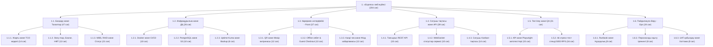

# Жұмыстарды бөлшектеу құрылымы (WBS) — «Express» жобасы (204 сағат)

```mermaid
graph TD
    ROOT["1. «Express» веб-жүйесі (204 сағ)"]

    ROOT --> B1["1.1. Басқару және Талаптар (47 сағ)"]
    ROOT --> B2["1.2. Инфрақұрылым және ДҚ (26 сағ)"]
    ROOT --> B3["1.3. Көрермен интерфейсі - Front (37 сағ)"]
    ROOT --> B4["1.4. Сатушы тақтасы және API (39 сағ)"]
    ROOT --> B5["1.5. Тестілеу және QA (31 сағ)"]
    ROOT --> B6["1.6. Пайдалануға беру - Ops (24 сағ)"]

    B1 --> P111["1.1.1. Жарғы және TCO моделі (14 сағ)"]
    B1 --> P112["1.1.2. Story map, Бэклог, НФТ (12 сағ)"]
    B1 --> P113["1.1.3. WBS, RAID және Статус (21 сағ)"]

    B2 --> P121["1.2.1. Docker және CI/CD (10 сағ)"]
    B2 --> P122["1.2.2. PostgreSQL және S3 (10 сағ)"]
    B2 --> P123["1.2.3. Uptime Kuma және Backup (6 сағ)"]

    B3 --> P131["1.3.1. QR және Мәзір витринасы (12 сағ)"]
    B3 --> P132["1.3.2. Offline себет & Guest Checkout (13 сағ)"]
    B3 --> P133["1.3.3. Kaspi чек және #Код хабарламасы (12 сағ)"]

    B4 --> P141["1.4.1. Тапсырыс REST API (15 сағ)"]
    B4 --> P142["1.4.2. WebSocket статустар сервисі (10 сағ)"]
    B4 --> P143["1.4.3. Сатушы Kanban-тақтасы (14 сағ)"]

    B5 --> P151["1.5.1. API және Playwright автотесттері (15 сағ)"]
    B5 --> P152["1.5.2. k6 стресс-тест стенді 5000 RPS (16 сағ)"]

    B6 --> P161["1.6.1. Runbook және Нұсқаулық (8 сағ)"]
    B6 --> P162["1.6.2. Персоналды оқыту тренингі (8 сағ)"]
    B6 --> P163["1.6.3. UAT қабылдау және Хаттама (8 сағ)"]
```
